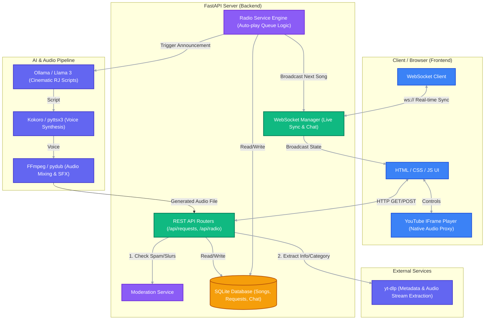

# 📻 Delux Radio

> *Tune in. Let Delux choose. Relive the 90s.*

A nostalgic, browser-based **90s Indian music radio station** — built with FastAPI, WebSockets, and pure HTML/CSS/JS. Listeners tune in, request songs, share dedications, and chat live — all together, as if sitting around the same radio.

---

## ✨ What is Delux Radio?

Delux Radio is not a playlist. It's not a music player. It's a **live radio station**.

- 🎵 **You don't choose what plays next.** Delux does.
- 📻 **Auto Radio** — 90s Bollywood songs play continuously from a curated catalog.
- 🎙️ **Song Requests** — Submit a song + story. A cinematic female RJ reads your dedication live on air.
- 💬 **Live Chat** — Talk with other listeners in real time, just like tuning into a station together.
- 🛡️ **Moderation** — Every message and request is filtered before going public.

---

## 🖼️ Preview


---

## 🚀 Quick Start

### Prerequisites

| Tool | Version | Ubuntu / Debian | Windows / Mac |
|------|---------|-----------------|---------------|
| Python | 3.10+ | `sudo apt install python3 python3-venv python3-pip` | [python.org](https://www.python.org/downloads/) |
| FFmpeg | Any | `sudo apt install ffmpeg` | [ffmpeg.org](https://ffmpeg.org/download.html) *(optional, for audio mixing)* |
| Node.js | Any | `sudo apt install nodejs` | [nodejs.org](https://nodejs.org/) *(optional, for YouTube JS challenge solving)* |
| Ollama + Llama 3 | Latest | `curl -fsSL https://ollama.com/install.sh \| sh` | [ollama.ai](https://ollama.ai) *(optional, for cinematic RJ scripts)* |

### 🔑 Permissions Setup (Linux / Ubuntu)

On Linux/Ubuntu, grant execution permissions once (or just run `bash start.sh`):

```bash
chmod +x start.sh tunnel.sh tunnel/tunnel.sh
```

### One-Click Start (Ubuntu / Linux)

```bash
# Run Delux Radio:
./start.sh
```
The script automatically handles everything: installs missing Ubuntu packages (`python3`, `python3-venv`, `ffmpeg`), builds the Python virtual environment (`venv`), installs dependencies, updates `yt-dlp`, and seeds the songs.


!wget -q https://github.com/cloudflare/cloudflared/releases/latest/download/cloudflared-linux-amd64 -O /tmp/cloudflared
!chmod +x /tmp/cloudflared

!/tmp/cloudflared tunnel --url http://localhost:8000


### 🌐 Public Internet Access (Tunnels)

In a second terminal window, run:
```bash
./tunnel.sh
```
Choose from:
- **ngrok (`--ngrok`)**: Official fast HTTPS tunnel (`*.ngrok-free.app`) with web traffic inspector.
- **Cloudflare Tunnel (`--cloudflare`)**: Instant free HTTPS domain (`*.trycloudflare.com`) without an account.
- **LocalTunnel (`--localtunnel`)**: Free instant HTTPS domain (`*.loca.lt`) with custom subdomain support.
- **Localhost.run (`--localhostrun`)**: Free SSH tunnel (`*.lhr.life`) with auto-reconnect.

### One-Click Start (Windows)

```bat
start.bat
```

The startup script will automatically:
1. Detect Python and create a virtual environment (`venv`)
2. Install / upgrade all dependencies (`requirements.txt` & `yt-dlp`)
3. Check for FFmpeg and Node.js
4. Launch the Delux Radio server on `http://localhost:8000`

### Manual Start (Ubuntu / Linux)

```bash
cd backend
python3 -m venv venv
source venv/bin/activate
pip install -r requirements.txt
python -m uvicorn main:app --host 0.0.0.0 --port 8000 --reload
```

### Access

| URL | Description |
|-----|-------------|
| `http://localhost:8000` | 🎵 Main Radio Player |
| `http://localhost:8000/admin.html` | 🔧 Admin Panel |

**Admin Login:** `admin` / `Awsedrft@123`

---

## 🏛️ Architecture



---

## 🏗️ Project Structure

```
Radio/
├── 📁 backend/
│   ├── main.py              # FastAPI app + WebSocket endpoint
│   ├── database.py          # SQLAlchemy models & DB setup
│   ├── seed_songs.py        # Seeds the 90s song catalog
│   ├── requirements.txt     # Python dependencies
│   ├── delux_radio.db       # SQLite database
│   ├── 📁 routers/
│   │   ├── radio.py         # Radio state API
│   │   ├── requests.py      # Song request API
│   │   ├── chat.py          # Chat history API
│   │   └── admin.py         # Admin management API
│   ├── 📁 services/
│   │   ├── radio_service.py # Radio engine (auto-play + queue logic)
│   │   └── moderation.py    # Content moderation
│   ├── 📁 ws/
│   │   └── manager.py       # WebSocket connection manager
│   └── 📁 audio/            # Generated RJ announcement audio files
│
├── 📁 frontend/
│   ├── index.html           # Main radio player UI
│   ├── admin.html           # Admin panel UI
│   ├── 📁 js/
│   │   ├── app.js           # Main app logic & WebSocket client
│   │   ├── player.js        # YouTube player integration
│   │   ├── chat.js          # Live chat UI
│   │   └── request.js       # Song request form
│   ├── 📁 css/              # Stylesheets
│   └── 📁 img/              # Images & icons
│
├── start.bat                # One-click startup script
├── newbanner.jpg            # Station banner
└── README.md
```

---

## 🎚️ How It Works

### 📻 Auto Radio Mode

When no requests are in the queue, Delux continuously plays 90s songs from its curated catalog.

```
SONG ENDS → CHECK QUEUE → EMPTY → AUTO-SELECT 90s SONG → PLAY → REPEAT
```

### 🎵 Request Mode

When a listener submits a song request:

```
SUBMIT REQUEST
    ↓
🛡️ MODERATION  (abusive/spam/slur check)
    ↓
90s CATALOG CHECK  (must be in the approved database)
    ↓
QUEUE  (waits for current song to finish)
    ↓
🤖 LLAMA 3  →  Generates cinematic RJ script
    ↓
🎙️ TTS  →  Female RJ voice (Kokoro / pyttsx3)
    ↓
🎵 MUSIC + SFX MIX  (audio layers via FFmpeg)
    ↓
ON-AIR RJ ANNOUNCEMENT
    ↓
🎵 REQUESTED SONG PLAYS
    ↓
AUTO RADIO RESUMES
```

### 💬 Live Chat

All connected listeners share a real-time chat room via WebSocket. Messages are moderated before broadcast. Rate limiting prevents spam (max 4 messages per 5 seconds).

---

## 🎙️ The RJ Experience

The heart of Delux Radio. The system doesn't just say *"This request is from Rahul for Pooja."*

**User writes:**
> *"I met Pooja in school in 2005. She used to sit near the window. We never spoke much. Years later we met again."*

**Llama 3 generates a cinematic radio script:**
> *"Some memories really do know how to find their way back to us. Rahul remembers meeting Pooja back in 2005… a classroom, a window seat, and all the things he never found the courage to say…"*

The audio is built in **layers**:

| Time | Element |
|------|---------|
| `00:00` | Soft nostalgic ambience |
| `00:03` | Female RJ voice begins |
| `00:15` | Emotional music enters (ducked under voice) |
| `00:42` | Music rises |
| `00:52` | Dedication & song intro |
| `01:00` | 🎵 Song plays |

Story moods detected: ❤️ Romantic · 🥹 Emotional · 🕰️ Nostalgic · 😄 Funny · 💔 Heartbreak · 👨‍👩‍👧 Family · 🧑‍🤝‍🧑 Friendship · 🎓 School / College

---

## 🛡️ Moderation

Every user-generated input passes through content moderation:

- ✅ Song name
- ✅ Requester name
- ✅ Dedication / "for someone"
- ✅ Story text
- ✅ Chat messages

**Blocked content:** abusive language, slurs, sexual/explicit text, harassment, hate speech, altered-spelling bypasses.

Rejected content **never** reaches the public display or TTS system.

---

## 🎛️ Admin Panel

Accessible at `/admin.html` — manage the station:

- 📋 View & manage the song catalog
- ➕ Add / activate / deactivate songs
- 📥 View pending song requests
- 💬 Moderate chat messages
- 📊 Live listener count

---

## 🔌 API Overview

| Method | Endpoint | Description |
|--------|----------|-------------|
| `GET` | `/api/radio/state` | Current radio state |
| `GET` | `/api/radio/queue` | Current request queue |
| `POST` | `/api/requests/` | Submit a song request |
| `GET` | `/api/chat/history` | Recent chat messages |
| `GET` | `/api/admin/songs` | List all songs (admin) |
| `POST` | `/api/admin/songs` | Add a song (admin) |
| `WS` | `/ws` | WebSocket (radio + chat) |

---

## 🧰 Tech Stack

### Backend
| Technology | Purpose |
|------------|---------|
| **FastAPI** | REST API + WebSocket server |
| **SQLAlchemy + SQLite** | Song catalog, chat, request storage |
| **Uvicorn** | ASGI server |
| **Llama 3 (via Ollama)** | Cinematic RJ script generation |
| **Kokoro TTS / pyttsx3** | Female RJ voice synthesis |
| **pydub + FFmpeg** | Audio mixing (voice + music + SFX) |
| **python-jose + passlib** | Admin JWT authentication |

### Frontend
| Technology | Purpose |
|------------|---------|
| **HTML / CSS / JS** | Pure vanilla frontend |
| **YouTube IFrame API** | Song playback (embedded player) |
| **WebSocket** | Real-time radio state & live chat |

---

## ⚙️ Configuration

The song catalog is seeded automatically on first startup via `seed_songs.py`.

Each song entry contains:

```
Song Name | Artist | Movie/Album | Year | Language | YouTube Video ID | Active
```

Only songs from the **1990–1999** era in the approved catalog are accepted for requests.

---

## 🎧 Listener Controls

Intentionally minimal — you're tuning into a radio, not controlling a playlist:

| Control | Available |
|---------|-----------|
| ▶️ Play | ✅ |
| ⏸️ Pause | ✅ |
| 🔊 Volume | ✅ |
| 🔇 Mute | ✅ |
| ⏭️ Skip / Next | ❌ |
| ⏮️ Previous | ❌ |
| ⏩ Seek / Forward | ❌ |
| 📋 User Playlist | ❌ |

> *"You don't choose what comes next. You tune into Delux and let Delux choose."*

---

## 📦 Dependencies

```
fastapi          uvicorn[standard]   sqlalchemy
aiofiles         python-multipart    websockets
pydantic         httpx               pydub
jinja2           python-jose         passlib
bcrypt           python-dotenv
```

Optional (auto-installed by `start.bat`):
- `kokoro` + `soundfile` — high-quality TTS
- `pyttsx3` — fallback TTS
- `ffmpeg` — audio mixing

---

## 🤝 Philosophy

Delux Radio is built on one idea:

> **Real radio doesn't ask you what to play next.**

Listeners don't control the station — they tune in, they connect, they share moments. The RJ is the bridge between listener hearts and the music. Delux automates that magic.

---

*Made with ❤️ and 90s nostalgia.*
